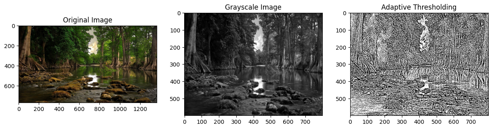
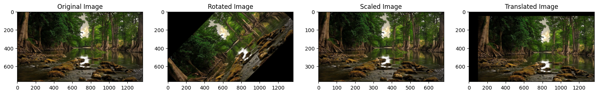
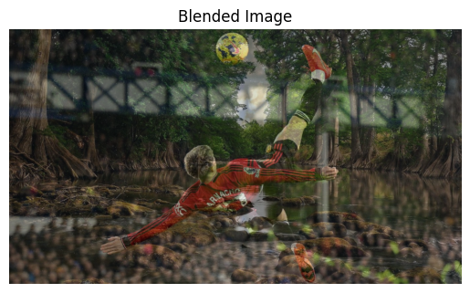

# 🖼️ Image Processing with OpenCV

This project demonstrates various image processing techniques using **OpenCV** and **Python**. The focus is on image transformations, such as **rotation**, **scaling**, **translation**, and **blending**, along with the application of **adaptive thresholding** for binary conversion. The project includes visualizations for each technique and evaluates how each transformation alters the image.

---

## 📑 Table of Contents

- [Project Objective](#project-objective)
- [Image Transformations](#image-transformations)
  - [Rotation](#rotation)
  - [Scaling](#scaling)
  - [Translation](#translation)
  - [Adaptive Thresholding](#adaptive-thresholding)
  - [Blending](#blending)
- [Visualizations & Analysis](#visualizations--analysis)
  - [Collaged Visualizations](#collaged-visualizations)
- [How to Run](#how-to-run)
- [Tech Stack](#tech-stack)
- [Future Improvements](#future-improvements)

---

## Project Objective

The goal of this project is to explore and apply common image transformation techniques, such as **rotation**, **scaling**, **translation**, **adaptive thresholding**, and **image blending** using **OpenCV**. We aim to provide visual insights into how these transformations affect the image, and how they can be used for image processing tasks such as preprocessing, augmentation, and blending.

The transformations are demonstrated using two images:
- **Cave.jpg**: A sample image that undergoes transformation and thresholding.
- **Garnacho.jpg**: A second image that is blended with the first one to create a composite image.

---

## Image Transformations

### Rotation
Rotation is applied to the image by a specified angle, changing its orientation. This can be useful for aligning or augmenting images.

### Scaling
Scaling resizes the image by a given percentage. This transformation is useful for adjusting image dimensions and resolution.

### Translation
Translation shifts the image in the x and y directions. This transformation helps move an image without changing its orientation.

### Adaptive Thresholding
Adaptive thresholding converts an image to a binary (black and white) format based on local pixel intensity variations. It is effective in highlighting important features like edges.

### Blending
Image blending combines two images into a single image. This can be achieved by controlling the transparency of each image (via alpha blending).

---

## Visualizations & Analysis

### Collaged Visualizations

In this section, we show the results of multiple transformations and thresholding applied to the images in a **collaged format**. Below is a collage of several transformations applied to the **Cave.jpg** image.

#### **Original Image, Grayscale Image, and Adaptive Thresholding Collage**

This collage showcases the original image, the grayscale conversion, and the result after adaptive thresholding.



> The collage above shows the evolution of the original image to a grayscale version and then to a binary (black-and-white) version using adaptive thresholding. Adaptive thresholding is particularly useful in distinguishing important features like edges from the background.

#### **Rotated, Scaled, and Translated Images Collage**

This collage demonstrates the effect of rotation, scaling, and translation applied to the original image.



> In this collage, the image undergoes rotation (45 degrees), scaling (50% of the original size), and translation (shifted 100 pixels in the x direction and 50 pixels in the y direction). These transformations change the image’s orientation, size, and position.

#### **Blended Image**

Here, we show the result of blending the two images: **Cave.jpg** and **Garnacho.jpg**.



> The blended image demonstrates how two images can be combined into a seamless composition using alpha blending. The transparency of each image can be adjusted to create smooth transitions.

---

## How to Run

To run this project locally:

```bash
# Clone the repository
git clone https://github.com/MK3685/image-processing-project.git

# Navigate to the folder
cd image-processing-project

# Install dependencies
pip install -r requirements.txt

# Run the Python script
python src/image_processing.py
